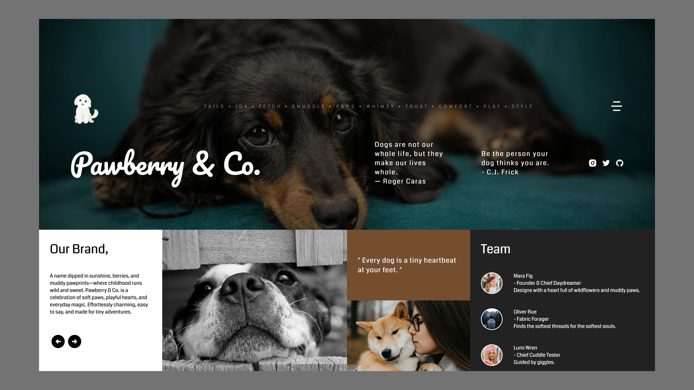

# Pawberry & Co.

A wholesome, cozy landing page designed for a pet/lifestyle brand — filled with warmth, charm, and just the right amount of pawprints.

---

## ✨ Features

- Full-screen hero with soft overlay content  
- Grid-based storytelling layout  
- Playful yet elegant brand typography  
- Built using HTML, CSS, and JavaScript  

---

## 🔗 Live Preview

- [View Website](https://milanxcode.github.io/Pawberry-Co/)  

---

## 🛠 Tech Stack

- HTML5  
- CSS3  
- JavaScript  

---

## 📸 Screenshots

---

## 💡 Inspiration

A celebration of muddy paws, soft snoots, and tiny tail wags — designed for brands that love dogs as much as they love design.
